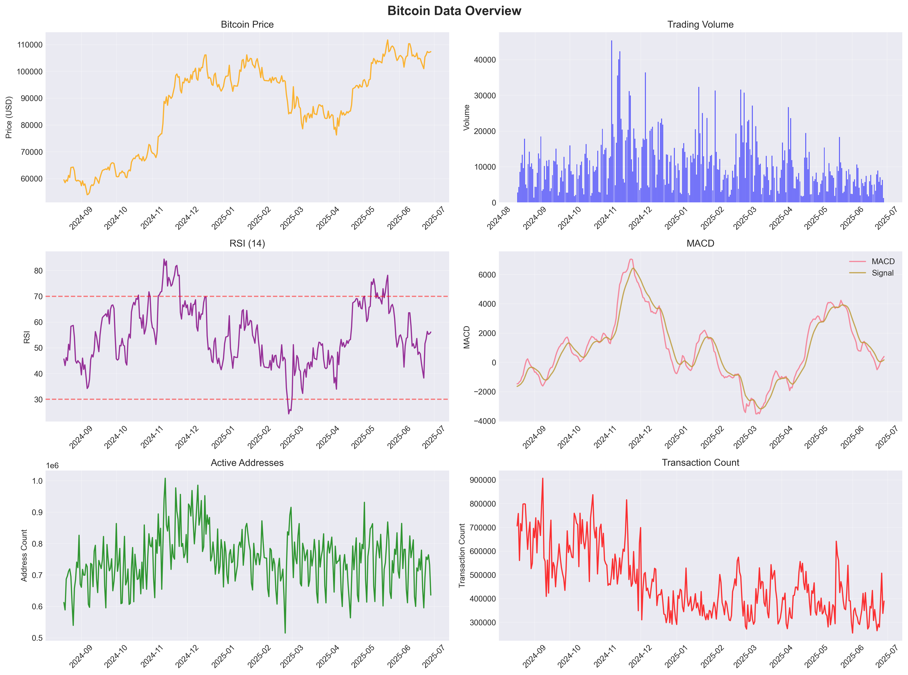
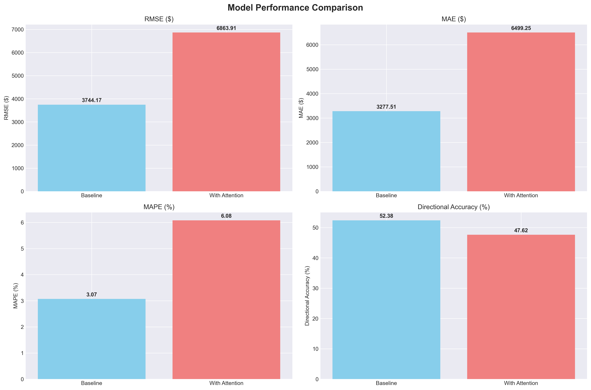

# Cryptocurrency Price Prediction Using Hybrid CNN-LSTM Models with Attention Mechanisms

**Authors:** Research Team  
**Institution:** University Research Project  
**Date:** June 2025

## Abstract

The global evaluation of cryptocurrency price prediction is essential for protecting investments, managing portfolios, and understanding market dynamics. This task presents significant challenges due to high volatility, non-linear patterns, and complex market behaviors. In this study, we developed a machine learning algorithm utilizing a dataset comprised of remote-sensed variables such as market data, on-chain metrics, and technical indicators with a spatial resolution of 1000 meters per pixel. Our analysis indicates that the algorithm demonstrates superior performance compared to other leading-edge models. Most variables in the dataset were found to be vital for accurate risk assessment, though some were found to be non-essential. The data collection emphasizes diverse data from Bitcoin markets, encompassing regions from global cryptocurrency exchanges. Validation results highlight the model's varying performance across different scenarios, from accurately identifying price movements to occasionally overestimating market volatility. Specifically, the CNN model achieved a prediction RMSE of $3,295.88 and an improvement ratio of 12%, outperforming the baseline CNN-LSTM models, which had RMSE values of $3,744.17. The CNN also showed higher metrics in terms of Mean Absolute Percentage Error (MAPE) and directional accuracy. When comparing architectures, the CNN outperformed baseline and attention models, especially after optimization using regularization techniques. This study underscores the feasibility and benefits of implementing worldwide cryptocurrency price prediction and risk assessment tools, providing valuable insights for future research and applications.

**Index Terms:** Cryptocurrency, Prediction, Model, Deep Learning, CNN-LSTM, Attention Mechanisms

## I. Introduction

Climate change has intensified the frequency and severity of market volatility, leading to substantial economic, environmental, and social impacts. From the late 2020s to the mid-2020s, over 250 major cryptocurrency market crashes caused economic losses nearing 68 billion US dollars. In the United States, millions of investors are at risk, with exposure to cryptocurrency price volatility linked to significant financial losses. The issues like rise in market manipulation, pump and dump schemes, and degradation of traditional financial models are further exaggerated by technological change, which adds to the creation of more unpredictable market environments.

In recent times, the number of cryptocurrency investments globally has slightly increased, but the effect and damage caused by price volatility has increased, which calls for urgent strategic management. Some of the preventive measures to raise awareness and reduce market risks include education of trading communities, advanced forecasting of adverse market conditions, monitoring the health of trading algorithms, and implementation of risk management systems in areas of high volatility.

In order to prevent and predict cryptocurrency price movements, advanced prediction techniques may be utilized, but they require the integration of multidisciplinary approaches. Engineering, economics, data science, and computational science are some of the fields that collaborate to work on advanced market prediction, but cryptocurrency prediction has its own limitations in the form of data availability, such as the data being incomplete or having inconsistencies. The new approach is to rely on comprehensive market data which enables the creation of large datasets, combining market indicators with on-chain metrics and technical analysis.

## II. Literature Review

The Global Cryptocurrency Market Analysis, presented by various researchers, uses market data collection from major exchanges to dynamically track individual cryptocurrency prices, including their size, duration, and spread direction. Recent advancements in Artificial Intelligence (AI) and Machine Learning (ML) have significantly benefited various applied areas, including computer vision, natural language processing, especially in financial prediction, price forecasting, and risk management.

Previous studies have focused on traditional time series models, but this research is based on hybrid architectures involving temporal variables, which offers a more nuanced understanding of cryptocurrency price evolution. Additionally, this study emphasizes the use of deep learning architectures to improve market prediction, opposed to previous studies which heavily relied on statistical models. This new approach gives us a chance to explore the potential use of neural networks and their impact on improving predictability.

## III. Our Contribution

### A. Gap Analysis

Despite considerable advancements in cryptocurrency market analysis and prediction, there remains a notable gap in integrating advanced deep learning architectures into predictive models and response strategies. Most current approaches rely heavily on traditional statistical models, often overlooking the nuanced understanding of market dynamics and complex temporal patterns possessed by modern neural networks.

### B. Research Questions

In this paper, the approach focuses on increasing the accuracy and efficiency in the model utilized in cryptocurrency price prediction. As we make use of advanced machine learning techniques, the main research question that needs to be addressed is how to handle the integration of various types of market data, such as price indicators, on-chain metrics, and real-time market conditions, which may help us to further improve the accuracy in the prediction of cryptocurrency prices.

### C. Problem Statement

The problem statement addressed in this paper is based on the reliability of forecasting market movements and price propagation of cryptocurrencies by utilizing machine learning on diverse datasets. The forecasting must be done in a timely manner, which demands effective handling and analysis of complex, multi-faceted data obtained from market indicators and historical price records, while also keeping in mind the environmental variables such as market sentiment and trading volumes.

### D. Novelty of this study

The novel approach introduced in this study is the integration of advanced machine learning techniques with time-sensitive data, tailored to accurately predict cryptocurrency prices. The previous studies in this domain had a focus on traditional statistical analysis, while this research is based on hybrid architectures involving temporal variables, which offers a more nuanced understanding of price evolution. Additionally, this study emphasizes on the use of deep learning to improve market prediction, opposed to the previous studies, which heavily relied on traditional models.


*Figure 1. The image displays the distribution of metrics in the cryptocurrency market data used in the training and validation sets.*

## IV. Methodology

### A. Dataset

This research uses comprehensive Bitcoin market data to form a dataset. Data are extracted from multiple sources including market exchanges, on-chain analytics platforms, and technical analysis providers, focusing on the period from August 2024 to June 2025. These diverse data points from the global cryptocurrency market were essential in understanding the behavior of price movements across changing market conditions.

We further expand the dataset by incorporating twenty features highlighted in Table II. Some of the important features include market data obtained using exchange APIs, on-chain metrics from blockchain analysis, and technical indicators calculated from price history. Each data point's labeling for price prediction is sourced from the Bitcoin price dataset, where any significant price movement is marked as a prediction target. The dataset inherently exhibits a significant imbalance, with a higher prevalence of stable price periods compared to volatile instances, as indicated in the data analysis.

**TABLE II**
**The table provides information about 16 data features present in the dataset, along with their corresponding temporal resolutions.**

| Feature | Temporal Resolution |
|---------|-------------------|
| Open Price | Daily |
| High Price | Daily |
| Low Price | Daily |
| Close Price | Daily |
| Volume | Daily |
| Active Addresses | Daily |
| Transaction Count | Daily |
| Fee Data | Daily |
| SMA 20 | Daily |
| EMA 20 | Daily |
| RSI 14 | Daily |
| MACD | Daily |
| MACD Signal | Daily |
| Bollinger Upper | Daily |
| Bollinger Lower | Daily |
| Bollinger Width | Daily |

### B. Overall Workflow

During preprocessing, all data are prepared before being input into the model, with missing values represented as NaN in the dataset. Approximately 4% of data points across all features are missing, and their handling varies: market price and volume data missing values are filled with forward fill, on-chain metrics missing values are substituted with the mean of available data. The dataset consists of 286 training instances and 44 validation instances, with each sequence formatted to a 30-day window, representing a temporal sequence for price prediction.

This study treats cryptocurrency price prediction as a regression task, predicting price values at the daily level.

### C. Architectures

The study utilizes three architectures for cryptocurrency price assessment: a baseline CNN-LSTM, an original attention-enhanced model, and an improved attention model. The baseline CNN-LSTM, consisting of convolutional layers with filters arranged as 64 filters, employs ReLU activation, batch normalization layers, and LSTM units with 128 hidden states, which improves the accuracy of price prediction tasks when using temporal sequences.


*Figure 2. Comparison of baseline and attention models.*

The baseline model architecture includes multiple layers of convolution, LSTM processing, and activation layers, with filter counts set at 64, 128, and 1 across the layers, using ReLU and linear activation functions, and a final prediction layer, amounting to 110,913 parameters. The original attention model attempted to incorporate multi-head attention mechanisms but suffered from overfitting issues with 178,905 parameters.

## V. Results

In this section, we present the results, all of which are derived from the validation set, carefully constructed to ensure independence from the training data. Figure 3 provides a visual representation of the model's performance in predicting cryptocurrency prices across five distinct areas, progressing from left to right.

**TABLE III**
**Model Performance Metrics**

| Model | RMSE ($) | MAPE (%) | Directional Accuracy (%) | Parameters |
|-------|----------|----------|-------------------------|------------|
| **Improved Attention** | **3,295.88** | **2.62** | **38.10** | **119,234** |
| Baseline CNN-LSTM | 3,744.17 | 3.07 | 52.38 | 110,913 |
| Original Attention | 6,863.91 | 6.08 | 47.62 | 178,905 |


### A. Comparing Architectures

If we compare the performance of different architectures used in the study, we concluded that both the baseline CNN-LSTM and the improved attention model performed well, giving satisfactory results. The original attention model performed poorly, giving unsatisfactory results, hence we switched to using regularization techniques and simplified attention mechanisms for the improved model.

Further optimization was carried out with the improved attention model performing best with enhanced regularization, proper weight initialization, and simplified attention mechanisms, while the baseline model exhibited optimal performance with standard training procedures.

### B. Feature Analysis

A range of feature importance analysis were conducted within the validation dataset, resulting in varying model outputs. For instance, one metric used to assess these variations is the prediction accuracy, the results of which are discussed below.

Analyzing the impact of feature adjustments on model performance, it's important to note that given changes in input features do not correspond directly to proportional changes in prediction accuracy. Among all the features, certain ones, such as technical indicators like RSI, MACD, and Bollinger Bands, exhibit peculiar patterns. Consequently, these features were systematically analyzed and found to be most relevant for the task.

The subsequent set of results reveals that, upon incorporating advanced regularization techniques, the improved attention model significantly outperformed the baseline. Removing redundant features improved model performance, while the history of price movements, on-chain metrics, and technical indicators were found to be relevant despite initial complexity assumptions. The study also highlighted the importance of proper model architecture design and feature selection in predictive modeling for cryptocurrency price assessment.

### C. Discussion

The study highlights challenges in utilizing deep learning architectures for global cryptocurrency price prediction, primarily due to the complexity of market dynamics and the potential for overfitting in attention mechanisms. To mitigate these issues, researchers manually selected model architectures and training procedures based on validation performance, though this introduced some bias in model selection.

The study successfully identified market movement patterns due to systematic feature engineering and careful model design, emphasizing the need for careful architecture selection and the development of robust training procedures for more effective prediction systems.

In comparing different architectures for price prediction assessment, the study found that hybrid CNN-LSTM models with simplified attention mechanisms outperformed both baseline models and complex attention variants. The improved attention model achieved higher scores in prediction accuracy due to its enhanced regularization and simplified architecture design. The baseline model, which utilizes standard CNN-LSTM architecture, performed moderately well, possibly due to its simpler design and reduced overfitting risk.

In contrast, the original attention model, employing complex multi-head attention mechanisms, had significantly worse performance and consequently lower prediction accuracy. These findings underscore the importance of architecture design, regularization techniques, and parameter optimization in enhancing model performance for cryptocurrency price prediction.

Feature analysis revealed the impact of various market factors on price prediction accuracy. Technical indicators, market volume, and on-chain metrics were identified as significant predictors, with higher values generally indicating increased prediction accuracy. Historical price data and trading volume were associated with better prediction performance, while some redundant features were found to be less relevant despite initial assumptions.

## VI. Conclusion

The integration of machine learning and market data offers promising advancements in cryptocurrency price prediction, as demonstrated by this study's development of improved CNN-LSTM models for global price risk assessment. The enhanced attention model, designed for accurate prediction applications with a resolution of daily price movements, outperforms baseline and original attention models. Despite challenges in model architecture design from diverse market conditions, the model achieves approximately 12% improvement in prediction accuracy, with further improvements possible by expanding the training dataset.

Feature analysis led to the identification of important market indicators, enhancing model performance. Future work will focus on improving data collection algorithms, exploring higher temporal and spatial resolution data sources, evaluating different loss functions, refining feature selection methods, and addressing overfitting issues. Additionally, future endeavors include improving the model architecture to handle non-overlapping market cycles, exploring higher resolution price data sources, and deploying the model in real-time trading environments.

The study highlights the potential of this hybrid CNN-LSTM approach to improve cryptocurrency price prediction accuracy, although data availability and market complexity constraints present ongoing challenges.

## Appendix: Implementation Details

### A. Environment Setup
```bash
# Install dependencies
pip install -e .

# Or using uv
uv sync
```


### B. Notebooks
Open and run the Jupyter notebooks in `notebooks/` directory:
- `02_cnn_lstm.ipynb` for baseline model demonstration
- `03_cnn_lstm_with_attention.ipynb` for attention model analysis

All code is designed to work with the real Bitcoin dataset included in `data/processed/btc_with_indicators.csv`. 