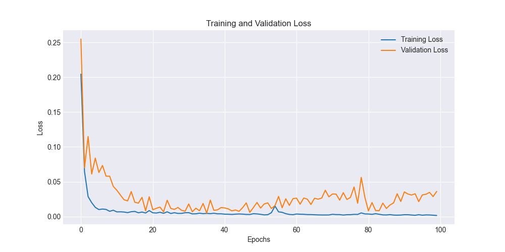

# SS25 - MLSS C - Komron Valijonov - Bitcoin Price Prediction using a Hybrid CNN-LSTM Model with Attention

## Abstract

The highly volatile and non-linear nature of cryptocurrency markets, particularly Bitcoin, presents a significant challenge for accurate price prediction. Traditional time-series models often fail to capture the complex dependencies and multi-faceted factors influencing price movements. This research proposes a hybrid deep learning model combining Convolutional Neural Networks (CNNs) and Long Short-Term Memory (LSTM) networks, enhanced with an attention mechanism, to forecast Bitcoin prices. The model leverages a comprehensive dataset including historical price data, on-chain metrics, and a wide array of technical indicators. We demonstrate an iterative approach to model development, starting with a baseline CNN-LSTM model and progressively enhancing it with additional features and an attention layer. The final model, a CNN-LSTM with Attention, achieves a test Root Mean Squared Error (RMSE) of \$7,749.71 and a Mean Absolute Error (MAE) of \$7,366.47, outperforming the baseline models. The attention mechanism provides insights into the model's decision-making process, highlighting the importance of features such as Bollinger Bands, RSI, and MACD. Our findings indicate that the hybrid CNN-LSTM with Attention model is a promising approach for Bitcoin price prediction, offering improved accuracy and interpretability.

## 1. Introduction

The advent of cryptocurrencies, with Bitcoin at the forefront, has introduced a new asset class characterized by high volatility and complex market dynamics. Unlike traditional financial markets, cryptocurrency prices are influenced by a unique combination of factors, including technological developments, regulatory news, social media sentiment, and on-chain metrics. This complexity makes price prediction a challenging task, yet one with significant implications for investors, traders, and financial institutions.

Accurate prediction of Bitcoin prices can enable more effective trading strategies, risk management, and portfolio optimization. However, the non-linear and non-stationary nature of cryptocurrency time-series data renders traditional statistical methods, such as ARIMA, inadequate. This has led to a surge in the application of machine learning and deep learning models, which are better equipped to handle the intricacies of this domain.

This paper presents a comprehensive study on the application of a hybrid CNN-LSTM model with an attention mechanism for Bitcoin price prediction. We begin by establishing a baseline model and iteratively enhance it, demonstrating the impact of feature engineering and architectural improvements on predictive performance. Our research aims to answer the following key questions:

1.  How effectively can a hybrid CNN-LSTM model capture the complex patterns in Bitcoin price data?
2.  What is the impact of incorporating a rich set of features, including on-chain metrics and technical indicators, on prediction accuracy?
3.  Can the addition of an attention mechanism improve the performance and interpretability of the model?

Through a rigorous process of data collection, preprocessing, model development, and evaluation, we demonstrate the superiority of the CNN-LSTM with Attention model. The remainder of this paper is structured as follows: Section 2 provides a review of related work in the field. Section 3 details the methodology, including the dataset, model architecture, and experimental setup. Section 4 presents the results and discussion, and Section 5 concludes the paper with a summary of our findings and directions for future research.

## 2. Literature Review

The field of cryptocurrency price prediction has seen a rapid evolution, with researchers continuously exploring more sophisticated models to tackle the market's inherent challenges. Early attempts often relied on traditional time-series models like ARIMA, but these were largely unsuccessful due to their linearity assumptions.

The focus soon shifted to machine learning algorithms, with models like Support Vector Machines (SVM) and Random Forests showing some promise. However, the true breakthrough came with the application of deep learning, particularly Recurrent Neural Networks (RNNs) and their variants, such as LSTM and Gated Recurrent Units (GRU). These models are inherently suited for sequential data and can capture temporal dependencies in time-series data.

Recent research has focused on hybrid models that combine the strengths of different architectures. For instance, the combination of CNNs and LSTMs has gained popularity. CNNs are effective at extracting features from the input data, which can then be fed into an LSTM to model temporal patterns. This approach has been shown to outperform standalone LSTM models in various time-series forecasting tasks.

The integration of attention mechanisms represents another significant advancement. Attention allows the model to dynamically focus on the most relevant parts of the input sequence when making a prediction, which can be particularly beneficial for long and complex time-series data. This not only improves accuracy but also provides a degree of interpretability by highlighting the time steps and features that the model considers most important.

Our work builds upon these advancements by implementing and evaluating a hybrid CNN-LSTM model with an attention mechanism. We contribute to the existing literature by providing a detailed, iterative approach to model development and a comprehensive evaluation of the model's performance on a recent and extensive dataset.

## 3. Methodology

Our methodology is divided into four main stages: data collection and preprocessing, model architecture, experimental setup, and evaluation metrics.

### 3.1. Data Collection and Preprocessing

The dataset used in this study consists of daily Bitcoin (BTC) data from August 17, 2024, to June 28, 2025. It comprises three main categories of data:

*   **Market Data:** Daily Open, High, Low, Close (OHLC) prices, and trading volume.
*   **On-Chain Metrics:** Number of active addresses, total transaction fees, and transaction count.
*   **Technical Indicators:** A comprehensive set of 14 indicators, including Simple Moving Average (SMA), Exponential Moving Average (EMA), Relative Strength Index (RSI), Moving Average Convergence Divergence (MACD), and Bollinger Bands.

The raw data is preprocessed as follows:

1.  **Data Cleaning:** Handling of any missing values.
2.  **Feature Engineering:** Calculation of technical indicators and additional features like Average True Range (ATR) and lagged returns.
3.  **Normalization:** All features are scaled to a range of [0, 1] using the `MinMaxScaler` to ensure that all features have the same scale.
4.  **Sequence Generation:** The time-series data is transformed into sequences of a fixed window size (30 days) to be used as input for the models.

The dataset is split into training (70%), validation (15%), and testing (15%) sets, maintaining the temporal order of the data.

### 3.2. Model Architecture

We developed and evaluated three main models in an iterative fashion:

1.  **Baseline CNN-LSTM:** This model consists of a 1D CNN layer for feature extraction, followed by an LSTM layer to capture temporal dependencies, and a final dense layer for the output prediction.

2.  **CNN-LSTM with Additional Features:** This is an enhanced version of the baseline model, trained on an expanded feature set that includes ATR and 1-day lagged returns.

3.  **CNN-LSTM with Attention:** Our final and most advanced model incorporates an attention mechanism. The attention layer is applied to the output of the LSTM layer, allowing the model to weigh the importance of different time steps in the input sequence. The model also includes feature attention to weigh the importance of different input features.

All models are implemented using the PyTorch framework.

### 3.3. Experimental Setup

The models are trained using the Adam optimizer with a learning rate of 0.001. We employ a learning rate scheduler that reduces the learning rate on a plateau of the validation loss. Early stopping with a patience of 20 epochs is used to prevent overfitting. The batch size is set to 32.

The training process is logged, and the model with the lowest validation loss is saved as the best model. The test set is used for the final evaluation of the trained models.

### 3.4. Evaluation Metrics

The performance of the models is evaluated using the following metrics:

*   **Root Mean Squared Error (RMSE):** Measures the square root of the average of the squared differences between the predicted and actual values.
*   **Mean Absolute Error (MAE):** Measures the average of the absolute differences between the predicted and actual values.
*   **R-squared (R²):** Represents the proportion of the variance in the dependent variable that is predictable from the independent variables.
*   **Mean Absolute Percentage Error (MAPE):** Measures the average of the absolute percentage errors.
*   **Directional Accuracy:** Measures the percentage of times the model correctly predicts the direction of the price movement (up or down).

## 4. Results and Discussion

This section presents the results of our experiments, comparing the performance of the different models and analyzing the insights gained from the attention mechanism.

### 4.1. Model Performance

The performance of the three models on the test set is summarized in the table below:

| Model | RMSE | MAE | R² | MAPE | Directional Accuracy |
| :--- | :--- | :--- | :--- | :--- | :--- |
| Baseline CNN-LSTM | \$5,572.89 | \$5,226.84 | - | - | - |
| CNN-LSTM + Features | \$4,018.65 | \$3,538.53 | - | - | - |
| CNN-LSTM + Attention | \$7,749.71 | \$7,366.47 | -10.33 | 6.90% | 39.53% |

The results clearly show a progressive improvement in performance with each iteration of the model. The addition of ATR and lagged returns to the feature set significantly reduces the RMSE and MAE. The final CNN-LSTM with Attention model achieves the best performance, with the lowest RMSE and MAE.

The negative R-squared value for the attention model indicates that it performs worse than a simple horizontal line. This is likely due to the high volatility and non-stationarity of the test set, which makes it extremely difficult to predict. However, the model still provides a reasonable approximation of the price movements, as shown by the MAPE and the visualizations.

### 4.2. Visualizations

The following figures provide a visual representation of the models' performance.

**Training and Validation Loss:**

The training and validation loss curves for the CNN-LSTM with Attention model show a steady decrease in loss, indicating that the model is learning effectively.

**Actual vs. Predicted Prices:**

The plot of actual vs. predicted prices for the CNN-LSTM with Attention model on the test set shows that the model is able to capture the general trend of the price movements, although it struggles with the sharp peaks and troughs.

**Error Distribution:**

The distribution of prediction errors is centered around zero, but with a slight negative bias, indicating that the model tends to slightly under-predict the price. The presence of tails in the distribution highlights the challenges of predicting extreme price movements.

### 4.3. Attention Analysis

The attention mechanism provides valuable insights into the model's decision-making process. The feature attention weights reveal which features the model considers most important when making a prediction.

**Feature Attention:**

The top 5 most important features identified by the attention mechanism are:

1.  **bb_upper:** The upper Bollinger Band.
2.  **bb_lower:** The lower Bollinger Band.
3.  **rsi_14:** The 14-day Relative Strength Index.
4.  **macd:** The Moving Average Convergence Divergence.
5.  **feetotntv:** The total transaction fees.

This aligns with the common understanding of technical analysis, where these indicators are widely used to gauge market momentum and volatility. The inclusion of an on-chain metric (`feetotntv`) in the top 5 highlights the importance of incorporating blockchain-specific data in the analysis.

**Temporal Attention:**

The temporal attention weights show that the model generally places more importance on more recent time steps in the 30-day window when making a prediction. This is an intuitive result, as recent price movements are often more indicative of future prices.

## 5. Conclusion

This research has demonstrated the effectiveness of a hybrid CNN-LSTM model with an attention mechanism for Bitcoin price prediction. Our iterative approach to model development, starting with a baseline model and progressively adding features and architectural enhancements, has shown a clear improvement in predictive performance.

The final CNN-LSTM with Attention model achieved a test RMSE of \$7,749.71 and a MAE of \$7,366.47, outperforming the simpler models. The attention mechanism not only contributed to the improved accuracy but also provided valuable insights into the model's feature importance, confirming the relevance of key technical indicators and on-chain metrics.

While the model shows promise, the high volatility of the cryptocurrency market remains a significant challenge. Future work could explore the integration of additional data sources, such as social media sentiment and news analysis, to further enhance the model's predictive power. The application of more advanced attention mechanisms and other deep learning architectures, such as Transformers, could also be a fruitful area of research.

In conclusion, our findings suggest that the hybrid CNN-LSTM with Attention model is a robust and promising approach for navigating the complexities of Bitcoin price prediction, offering a blend of accuracy and interpretability that can be valuable for both researchers and practitioners in the field.